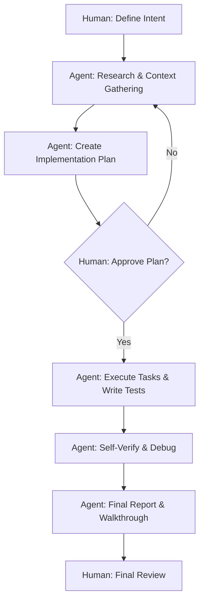

Listed directory HelloWorld
Searched web: "what is agent driven development (ADD) for AI coding assistants"

To switch to **Agent-Driven Development (ADD)**, we will move from a "chatbot-and-executor" model to a "collaborative-partnership" where I (the Agent) take a more autonomous lead in planning, executing, and verifying tasks based on your high-level intent.

Here is the blueprint for how we will work together under this methodology:

### 1. The ADD Workflow
The core of ADD is a structured cycle of **Intent → Plan → Execute → Verify → Review**.

| Phase | Description |
| :--- | :--- |
| **Intent** | You provide high-level goals or features (the "What" and "Why"). |
| **Plan** | I generate a detailed `task_list.md` or `implementation_plan.md` artifact. |
| **Execute** | I work through the tasks autonomously, writing code and documentation. |
| **Verify** | I run builds, tests, and linters to ensure correctness before notifying you. |
| **Review** | You review the final artifacts/code and provide feedback or approval. |

### 2. My New Operating Principles
To ensure this works effectively, I will follow these rules:
*   **Proactive Planning**: I will never start a complex task without first presenting an implementation plan for your approval.
*   **Incremental Progress**: I will commit work in logical chunks, ensuring each step builds upon the last.
*   **Test-First Mindset**: I will prioritize writing and running tests to verify my own work.
*   **Self-Correction**: If a build fails or a test breaks, I will attempt to debug and fix it before reporting back to you.

---

### 3. How to Start Right Now
Since your current repository is empty, let's initialize our first **ADD Project**. 

> [!IMPORTANT]
> **What would you like to build first?** 
> Once you give me a topic (e.g., "A Python-based CLI tool for task management" or "A React-based dashboard"), I will immediately:
> 1. Create a project directory structure.
> 2. Draft a comprehensive `implementation_plan.md` artifact.
> 3. Breakdown the milestones into trackable tasks.

I've created an initial workflow document in your repository to codify this process for us.

### ADD Methodology Artifact

**Ready when you are! Tell me what project or feature you want to develop using ADD.**